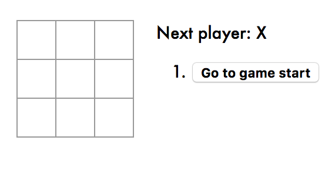
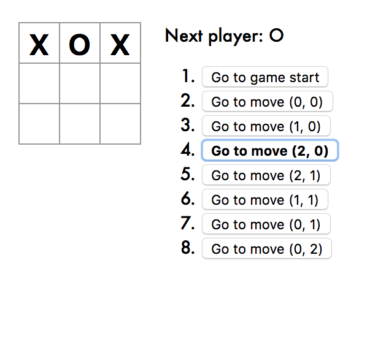
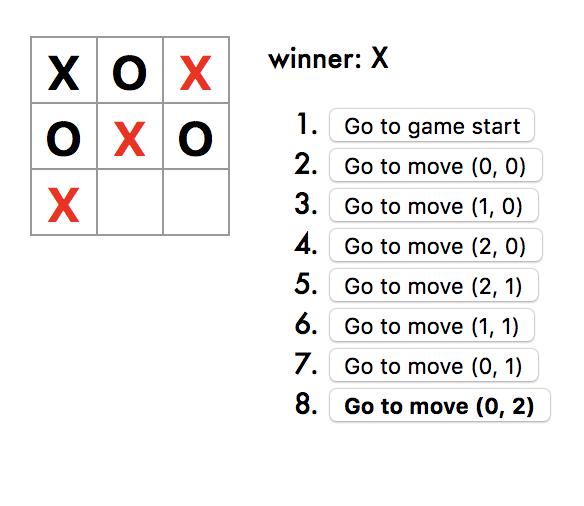
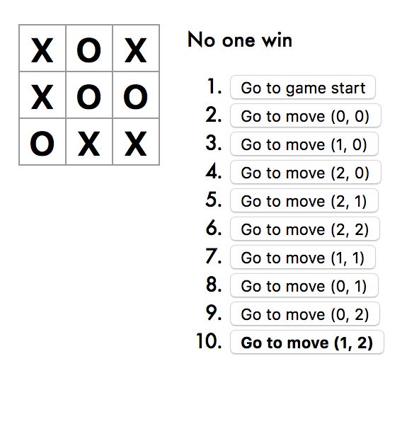

# Tic-Tac-Toe

An interactive tic-tac-toe game build using React, based on React tutorial doc

## Features

* lets you play tic-tac-toe,
* indicates when one player has won the game,
* stores the history of moves during the game,
* allows players to jump back in time to see older versions of the game board.
* Display the location for each move in the format (col, row) in the move history list.
* Bold the currently selected item in the move list.
* When someone wins, highlight the three squares that caused the win.
* When no one wins, display a message about the result being a draw.

## Sample screenshot

